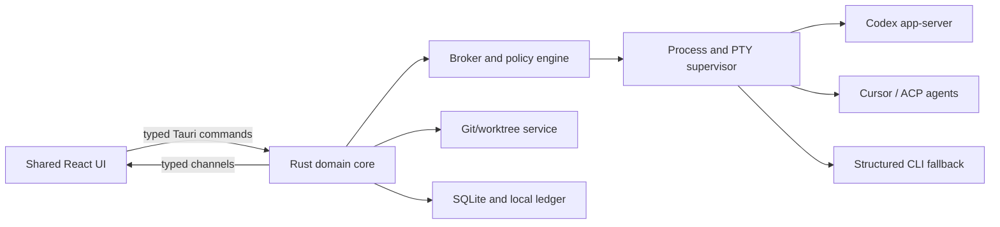

# AI Integrator v1 architecture

**Decision:** Tauri 2 + Rust core + shared React/TypeScript UI  
**Platforms:** Windows and macOS on one release train  
**Deployment model:** signed native installers; no application backend required

## 1. Meaning of “one native product”

AI Integrator is developed and versioned once. Windows and macOS packages share:

- product behavior and information architecture;
- React/TypeScript screens and design tokens;
- Rust task, run, delegation, usage, permission, Git, worktree, and recovery state machines;
- provider adapters and ACP/Broker contracts;
- SQLite schema, coordination ledger, transcript references, fixtures, and migrations;
- one semantic version and stable/beta release channels.

The installed application is a native executable using the operating system WebView. It is not a separate WinUI and SwiftUI product. OS-specific functionality is implemented behind narrow Rust traits and is invisible to the shared domain/UI layers.

## 2. Repository shape

```text
apps/
  desktop-ui/             React + TypeScript application
packages/
  ui/                     components, tokens, themes, editor/diff/terminal presentation
  contracts/              generated TypeScript DTOs and JSON Schemas
  fixtures/               sanitized event streams and replay scenarios
src-tauri/                 thin Tauri boot, windows, commands, capabilities
crates/
  domain/                 task/run/approval/usage/worktree state machines
  orchestrator/           delegation, budgets, checkpoints, recovery
  providers/              Codex, Cursor, ACP and structured-stream adapters
  broker/                 child tools, mailboxes, scoped transcript access
  repository/             Git, Git-common ledger, worktrees, diffs, staging
  supervisor/             processes, PTYs, stdin ownership, redaction
  platform/               Windows/macOS traits and implementations
  storage/                SQLite, migrations, retention, export/import
  release-contract/       adapter/runtime compatibility and update metadata
```

## 3. Trust boundary

The renderer has no arbitrary shell, filesystem, credential, or Git authority.



Rules:

1. Every renderer command uses a versioned input/output schema.
2. Every command is allowed by an explicit Tauri capability and the effective Integrator policy.
3. High-volume transcript, terminal, diff, and process events stream over bounded typed channels.
4. The broker is the sole writer for shared task state; agents own only their run scratch/results.
5. Credentials remain in vendor/OS stores and never cross into the renderer or coordination ledger.
6. Local IPC is process-bound or authenticated. v1 exposes no unauthenticated TCP/LAN listener.
7. In-app browser profiles are native-owned and group-scoped: one identity per project (every
   task in a project shares it); standalone chats share the `Chat` identity; Shared is an
   explicit, restart-bound choice. Older per-task jars stay listable and clearable but new tabs
   never use them. The renderer receives cookie and saved-login metadata, never cookie values or
   passwords.

## 4. Shared and platform-specific implementation

The following interfaces have Windows/macOS implementations behind the same Rust contract:

| Trait               | Windows                                                                    | macOS                                         |
| ------------------- | -------------------------------------------------------------------------- | --------------------------------------------- |
| `PtyHost`           | ConPTY                                                                     | POSIX PTY                                     |
| `ProcessTree`       | Job Objects, process-tree accounting and kill-on-close                     | process groups/sessions and signal escalation |
| `ShellEnvironment`  | PowerShell/cmd/PATH/WSL discovery                                          | login-shell PATH reconstruction               |
| `SecureStore`       | Windows Credential Locker/DPAPI-backed storage                             | Keychain                                      |
| `PathIdentity`      | drives, UNC, junctions, long paths, WSL mappings, case rules               | volumes, symlinks/aliases, case rules         |
| `NativeIntegration` | notifications, attention, reveal/open, external terminal, sleep inhibition | equivalent AppKit/system integrations         |

Provider adapters, Broker MCP, Git policy, task ledger, delegation, redaction, usage, themes, and UI remain shared.

## 5. Release artifacts

One source commit and one version may produce multiple artifacts:

| Target              | v1 status                                                 | Installer                       | OS trust                                              |
| ------------------- | --------------------------------------------------------- | ------------------------------- | ----------------------------------------------------- |
| Windows x64         | Required                                                  | per-user NSIS setup             | Authenticode signed and timestamped                   |
| macOS Apple Silicon | Required                                                  | notarized DMG containing `.app` | Developer ID, Hardened Runtime, notarized and stapled |
| macOS Intel         | Required unless audience data explicitly removes it       | separate notarized DMG          | same identity and notarization                        |
| Windows ARM64       | Fast-follow unless demand justifies day-one certification | separate per-user NSIS setup    | same Authenticode identity                            |

Different artifacts do not imply different products. They share version, release notes, capability matrix, migration level, and update channel.

## 6. Updates and rollback

- Stable and beta use separate HTTPS metadata endpoints.
- Every artifact is OS-signed and carries a Tauri updater signature. Update signature verification is mandatory.
- The updater private key exists only in release CI/key custody; the public key is embedded.
- Download may run in the background. Apply/relaunch occurs only after active agent, terminal, Git, and ledger state reaches a persisted safe boundary.
- Retain signed N-1 artifacts and compatibility metadata for rollback.
- An update may disable an incompatible adapter through signed compatibility metadata, but no hosted kill switch is required for normal operation.

Static update hosting or GitHub Releases is distribution infrastructure, not an AI Integrator application backend.

## 7. Pre-build executable spike

Do not begin broad UI implementation until one vertical spike proves:

1. Spawn and negotiate Codex app-server and Cursor ACP.
2. Reuse healthy vendor login and complete a logged-out flow through the user-owned Setup terminal/browser.
3. Run a persistent PTY with input, resize, full-screen TUI, no-echo input, user/agent stdin transfer, cancel, and process-tree termination.
4. Open a Git repository, create a writing worktree, compute a large syntax-aware diff, stage a hunk, commit, and verify push preview without pushing by default.
5. Replay 100,000 transcript/events and a 2,000-file change set without freezing interaction.
6. Crash/restart the shell and reconcile task, provider process, PTY, worktree lease, and uncertain Git outcomes.
7. Exercise IME/CJK, screen reader, high contrast, 200% scaling, clipboard, menus, and software rendering on real Windows and macOS machines.
8. Produce and install signed-development packages and exercise update/rollback in a clean VM/machine.

If Tauri/system-WebView behavior fails these gates after a bounded spike, Electron is the documented fallback. Separate WinUI and SwiftUI products are not the fallback.

## 8. Performance budgets

Targets are measured on a representative midrange Windows machine and Apple Silicon Mac:

- warm task switch: UI response within 100 ms;
- composer input: no visible keystroke lag under active streaming;
- stop control: local acknowledgement within 100 ms, runtime result reconciled separately;
- transcript: smooth navigation at 100,000 events through virtualization;
- diff: progressive/virtualized rendering; no full-window lock for a 2,000-file change set;
- terminal: sustained output does not starve input or task controls;
- cold launch and idle memory budgets are frozen after the spike and gate release regressions.

## 9. Primary sources

- [Tauri process model](https://v2.tauri.app/concept/process-model/)
- [Calling Rust and channels](https://v2.tauri.app/develop/calling-rust/)
- [Tauri permissions and capabilities](https://v2.tauri.app/security/permissions/)
- [Tauri updater](https://v2.tauri.app/plugin/updater/)
- [Windows installers](https://v2.tauri.app/distribute/windows-installer/)
- [macOS application bundle](https://v2.tauri.app/distribute/macos-application-bundle/)
- [Codex app-server](https://learn.chatgpt.com/docs/app-server)
- [ACP transports](https://agentclientprotocol.com/protocol/v1/transports)
